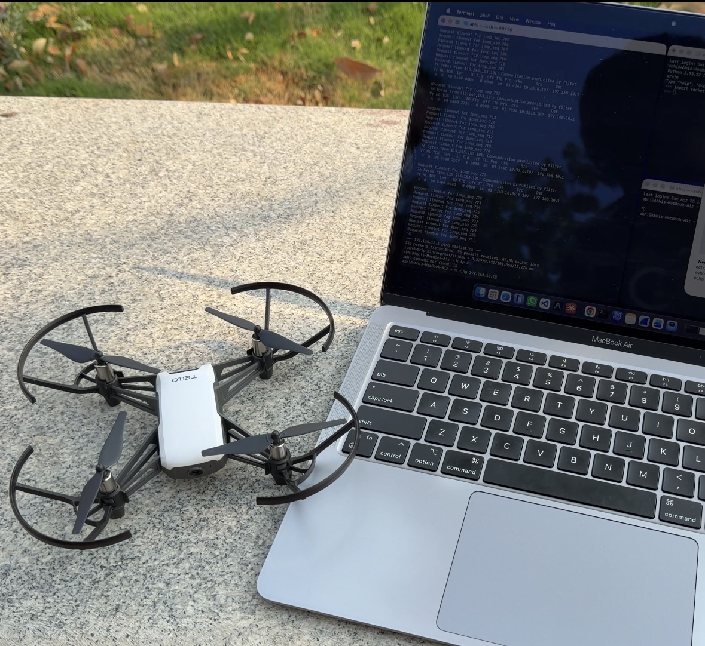

# 🛩️ Tello Drone Control and Analysis

## 👤 Author  
**Abhilash**

---

## 📌 Project Overview

This project demonstrates how a **Ryze Tello drone** can be controlled and analyzed using networking and cybersecurity techniques.

The objective of this experiment was to understand how IoT devices communicate over a network and how they can be controlled using different methods.

The project covers:
- UDP-based communication  
- Drone control using Python and Netcat  
- Network traffic analysis using Wireshark  
- Security risks in IoT systems  

---

## 📸 Project Setup

  

This setup shows the Tello drone connected to a laptop used for sending commands and analyzing network communication.

---

## 🎥 Demo Video

👉 https://drive.google.com/file/d/1ke49nUwqWxD3Ev8K1eridhKTGEC8sZLz/view?usp=sharing

---

## 📄 Project Report

👉 Tello_Drone_Control_Analysis_Abhilash.pdf  
(Uploaded in this repository)

---
